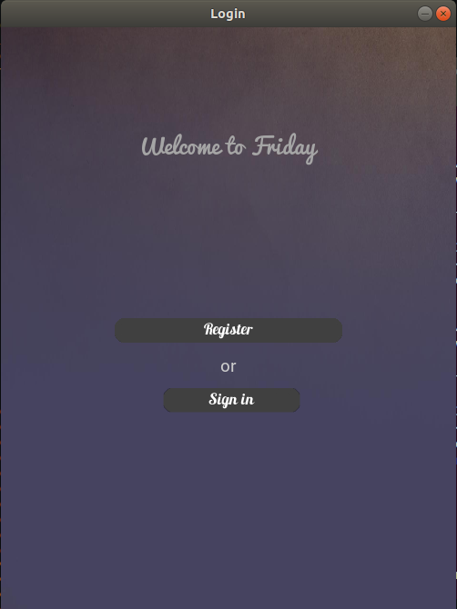
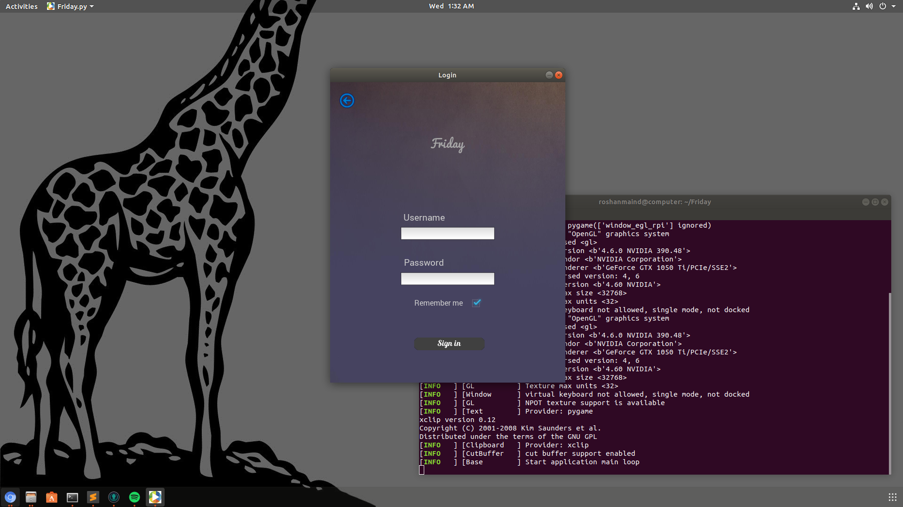
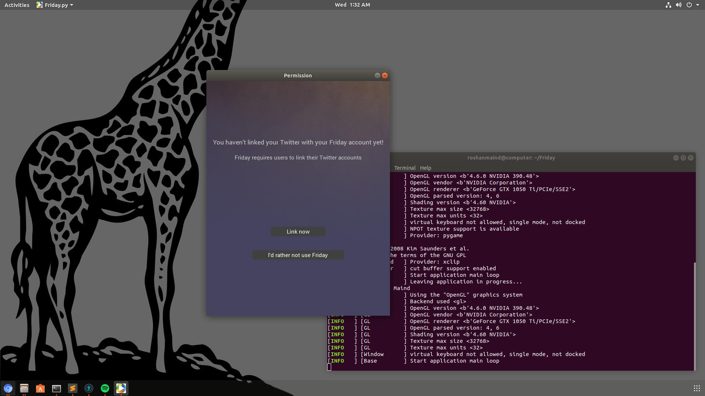
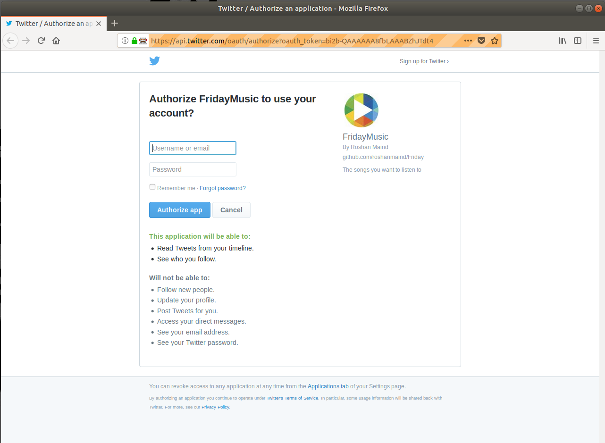
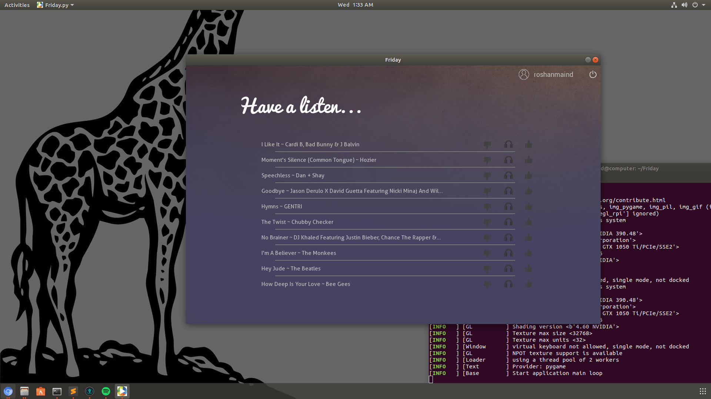

# Friday
Powered by Social media Health Analysis & Display Engine and IBM Watson, Friday understands your current state of mind,  
your overall taste in music and your interests and views about songs, artists or genres and gives you a specially curated,  
personalized playlist of the best songs she can find. Friday monitors and processes your activities on social media websites  
like Twitter and your interaction with the app itself to estimate what you would like the best.
  
For concerned potential users, your data is never sent to any external server. All of the data is always stored locally  
within your device.  
  
## Requirements
1. Python3  
2. Kivy  
3. geckodriver  

Python modules requirements are given in the requirements.txt file  
All the dependencies including OpenGL and geckodriver are installed automatically by the setup.py script  
when run on a Debian based Linux OS  
  
## Installation & Use

### NOTE
The app will not work unless 2 .keys files are put in the root directory of the project. For security purposes we could not  
upload the files on github. To obtain the files, send a mail to roshanmaind3434@gmail.com requesting the key files.  
##### What are these .keys files?
The .keys files contain the API keys for Twitter and IBM Watson APIs. If you already have API keys for the two services  
you may edit the twitter_interface module and the watson module in the modules folder to use your API keys instead.

#### Debian based Linux users 
Simply run the python script "setup.py" and then to use the software, run Friday.py.  
  
#### Windows users
1. First run the setup.py file to install python modules.  
2. Follow the complete Kivy installation process as show   
(Make sure you check  section of the guide)  
3. Then download the Mozilla Firefox geckodriver from   
(Download the right file according to your system type (32 or 64 bit))  
4. Make a folder in your C drive named "gecko"  
5. Extract the zip file and put the geckodriver.exe file in the gecko folder made in the previous step  
6. Run the following command in your cmd (Command Line/Command Prompt):-  
set PATH=%PATH%;C:\gecko\  
7. Run the Friday.py script to use the app.  

#### Android

  
## Future updates to come
1. Facebook connectivity.
2. Access to more frequently used social media services like DM.
3. Support for Windows, Mac OS and other Linux distros.

  
## Screenshots
  

  

    

