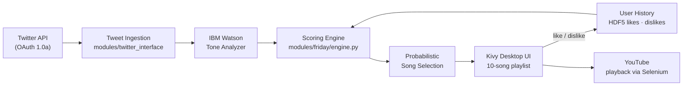

# Friday

Friday is a data-driven desktop music recommendation application that builds a personalized 10-song playlist by analyzing your Twitter activity in real time. It connects to the Twitter API to pull your recent tweets, runs them through IBM Watson's Tone Analyzer to extract emotional signals, then feeds those signals — along with your stored like/dislike history — into a probabilistic scoring engine that selects songs matched to your current mood and taste.

All processing and user data remain local to your machine. Nothing is sent to any third-party server beyond the Twitter and Watson API calls themselves.

[Screenshots](https://github.com/roshanmaind/Friday/tree/master/data/screens) · [Demo Video](https://github.com/roshanmaind/Friday/tree/master/data/video)

---

## Overview

Most recommendation systems treat your taste as static. Friday treats it as a live signal. Every time you run the app it fetches your latest tweets, reads the emotional tone of what you've been writing about, and adjusts song probabilities accordingly. Mentioning a genre, artist, or song title in a tweet — positively or negatively — shifts the deck in real time. Your historical likes and dislikes layer on top, so the engine learns your long-term preferences while still responding to how you feel right now.

---

## Architecture


```mermaid
flowchart LR
    A["Twitter API\n(OAuth 1.0a)"] --> B["Tweet Ingestion\nmodules/twitter_interface"]
    B --> C["IBM Watson\nTone Analyzer"]
    C --> D["Scoring Engine\nmodules/friday/engine.py"]
    E["User History\nHDF5 likes · dislikes"] --> D
    D --> F["Probabilistic\nSong Selection"]
    F --> G["Kivy Desktop UI\n10-song playlist"]
    G -->|"like / dislike"| E
    G --> H["YouTube\nplayback via Selenium"]
```

The pipeline runs end-to-end on each launch:

1. **Tweet Ingestion** — authenticates via OAuth, pulls the user's timeline, and separates tweets made in the last 24 hours from the full history.
2. **Sentiment Analysis** — concatenates tweets into an HTML-tagged document and sends them to Watson Tone Analyzer, capturing document-level tones (anger, joy, sadness, etc.) for the 24-hour window and sentence-level tones for mention detection across the full timeline.
3. **Recommendation Engine** — scores every song in the local catalogue against four independent signals, then normalizes scores into selection probabilities and samples 10 songs using weighted random draws.
4. **Desktop UI** — renders the playlist in a Kivy window where the user can like, dislike, or open any song directly in Firefox via Selenium.
5. **Persistence** — user session and OAuth tokens are stored with `pickle`; liked/disliked song histories are stored in HDF5 files and updated at the end of each session.

---

## Tech Stack

| Layer | Technology |
|---|---|
| Language | Python 3 |
| Twitter data ingestion | `python-twitter`, `requests-oauthlib` |
| NLP / Sentiment | IBM Watson Tone Analyzer (`watson-developer-cloud`) |
| Recommendation logic | Custom probabilistic scoring engine |
| Local data storage | HDF5 (`h5py`), `pickle` |
| Desktop UI | Kivy 1.10 |
| Browser automation | Selenium + Mozilla geckodriver |

---

## How It Works

The playlist each session is shaped by four scoring signals applied to every song in the catalogue:

### 1. Tweet Mentions + Sentiment
Watson returns sentence-level tone scores for each tweet. If a tweet mentions a song title, artist, or genre, the engine checks the tone of that specific tweet and adjusts the corresponding song's score:
- A positive mention (joy) boosts the score proportionally to how much you already like that artist or genre.
- A negative mention (anger, sadness) applies a small penalty.
- A neutral mention still registers as a positive signal.

### 2. Overall 24-Hour Mood
Watson's document-level tone for your last 24 hours is mapped to genre affinities:

| Tone | Favoured Genres |
|---|---|
| Joy | hip-hop, rock, edm, pop, country |
| Anger | hip-hop, rock, edm |
| Sadness | classical, rock, pop, jazz, country |
| Analytical | classical, jazz, country |

Songs in a favoured genre receive a score boost scaled by Watson's confidence in that tone.

### 3. Like / Dislike History
Songs by artists or in genres you've liked before accumulate positive score weight across sessions. Songs tied to artists or genres you've disliked receive penalties. The effect compounds — the more consistently you like a particular artist, the stronger the signal.

### 4. Probabilistic Selection
Scores are normalized into probabilities (0–1). Songs are sampled via repeated random draws against their probability, ensuring variety while respecting the signal weights. A curated "greatest of all time" tier receives a baseline score bonus, giving classic tracks a persistent edge.

---

## Project Structure

```
friday/
├── Friday.py                      # Application entry point
├── requirements.txt               # Python dependencies
├── setup.py                       # Automated installer (Linux & Windows)
├── modules/
│   ├── twitter_interface/
│   │   ├── tweets.py              # OAuth flow, timeline fetch, 24h filtering
│   │   └── get_token.py           # Twitter OAuth token exchange
│   ├── watson/
│   │   └── analyzer.py            # Watson Tone Analyzer integration
│   └── friday/
│       ├── engine.py              # Scoring and probabilistic recommendation
│       ├── main.py                # Kivy UI — playlist display, like/dislike
│       ├── loginator.py           # Login screen
│       └── greet.py               # Post-login greeting
├── data/
│   ├── friday/                    # User session, HDF5 databases, song catalogue
│   ├── screens/                   # App screenshots
│   └── video/                     # Demo video
└── dev_tools/                     # Development utilities
```

---

## Setup & Installation

### Prerequisites
- Python 3
- A Twitter Developer account with a registered app (Consumer Key + Consumer Secret)
- An IBM Cloud account with the Tone Analyzer service enabled

### API Keys

The application expects two key files in the project root. Refer to [`.env.example`](.env.example) for the values you need to obtain, then follow the original key-file format or contact the repository owner at roshanmaind3434@gmail.com to obtain pre-built key files.

### Debian / Ubuntu

```bash
python3 setup.py
python3 Friday.py
```

The setup script installs OpenGL, pip dependencies, Kivy, geckodriver, and xclip automatically.

### Windows

1. Run `python setup.py` to install Python dependencies.
2. Install Kivy manually following the [official Windows guide](https://kivy.org/doc/stable/installation/installation-windows.html) — pay attention to the [dependencies section](https://kivy.org/doc/stable/installation/installation-windows.html#kivy-s-dependencies).
3. Download the correct [Mozilla geckodriver](https://github.com/mozilla/geckodriver/releases) for your system (32 or 64-bit).
4. Create a folder at `C:\gecko\` and place `geckodriver.exe` inside it.
5. Add geckodriver to your PATH:
   ```cmd
   set PATH=%PATH%;C:\gecko\
   ```
6. Run the app:
   ```cmd
   python Friday.py
   ```

---

## Future Improvements

- **Additional social platforms** — extend the ingestion layer to Facebook and other high-usage services such as DMs.
- **macOS and non-Debian Linux support** — abstract the installer to support Homebrew and other package managers.
- **Streaming sentiment** — shift from batch tweet analysis to a live stream using the Twitter Filtered Stream API for continuous mood tracking.
- **Expanded song catalogue** — replace the static HDF5 catalogue with a Spotify or Last.fm API integration for a broader, always-current library.
- **Feedback loop tuning** — apply a lightweight collaborative filtering layer on top of the current scoring engine to improve long-term personalization.
